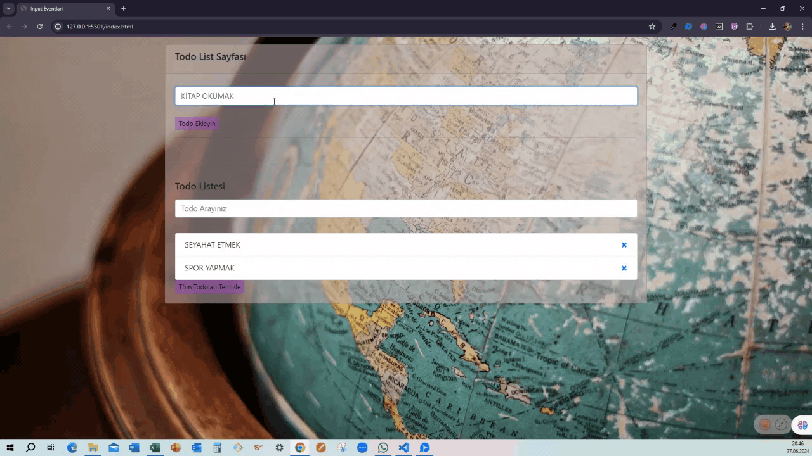

<h1> TO-DO Listesi Project </h1>

Bu proje, kullanıcıların yapılacaklar listesi oluşturmasını sağlayan basit bir To-Do Listesi uygulamasıdır. Kullanıcılar, yapılacak görevleri ekleyebilir, silebilir ve daha önce ekledikleri görevleri düzenleyebilir. Proje, tamamen HTML5, CSS ve JavaScript kullanılarak geliştirilmiştir.  

<h1> Özellikler </h1>

- _Görev Ekleme_: Kullanıcılar yapılacak bir görevi listeye ekleyebilir. 
- _Görev Silme_: İlgili görevin yanındaki silme butonu ile liste elemanını silebilir. 
- _Görev Düzenleme_: Daha önce eklenmiş görevler üzerine tıklanarak düzenlenebilir. 
- _Yerel Depolama (Local Storage)_: Liste, sayfa yenilense bile kaybolmaz. Tüm görevler tarayıcının yerel depolama alanında saklanır ve daha sonra tekrar yüklenebilir. 

<h1> Kullanılan Teknolojiler </h1>

- _HTML5_: Sayfa yapısını oluşturmak için kullanıldı. 

- _CSS_: Görev listesinin stilini ve görünümünü düzenlemek için kullanıldı. 

- _JavaScript_: Listeye görev ekleme, silme ve düzenleme gibi dinamik işlemleri yönetmek için kullanıldı. 

- _Local Storage_: Kullanıcıların eklediği görevlerin tarayıcıda saklanmasını sağlamak için JavaScript'in localStorage API'si kullanıldı  

<h1> Kullanımı </h1>

1.Sayfaya görev eklemek için metin kutusuna bir görev girin ve Ekle butonuna tıklayın. 

2.Listeye eklenen görevlerin yanındaki Sil butonuna basarak görevi listeden kaldırabilirsiniz. 

3.Daha önce eklenmiş bir göreve tıklayarak, görev üzerinde düzenleme yapabilir ve değişiklikleri kaydedebilirsiniz. 

 <h1> Yerel Depolama </h1>

Bu uygulama, tarayıcının Local Storage özelliğini kullanarak kullanıcıların eklediği görevleri kaydeder. Sayfa yenilendiğinde veya tarayıcı kapatılıp yeniden açıldığında bile görevler korunur. 
 
 <h1> Ekran Görünümü </h1>

